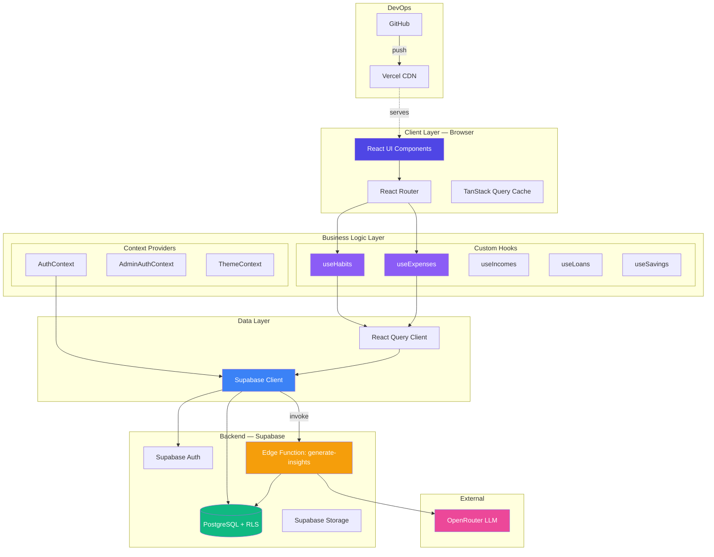
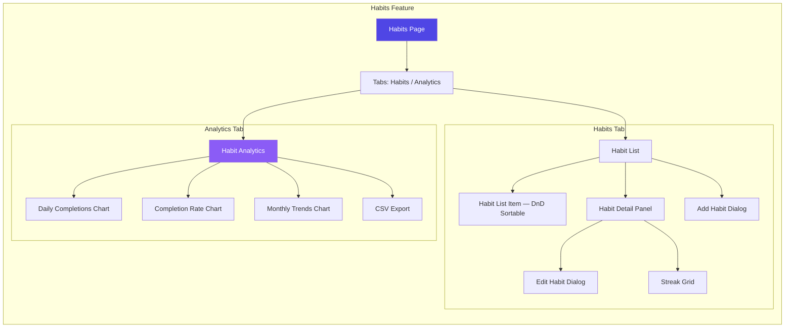
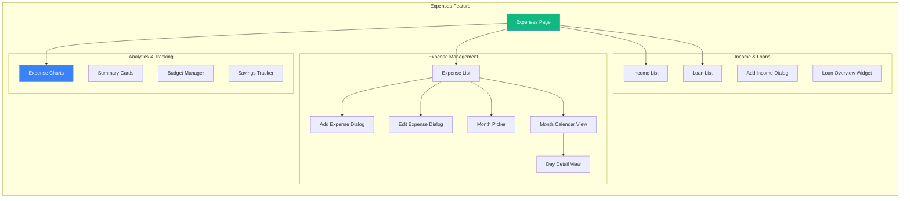
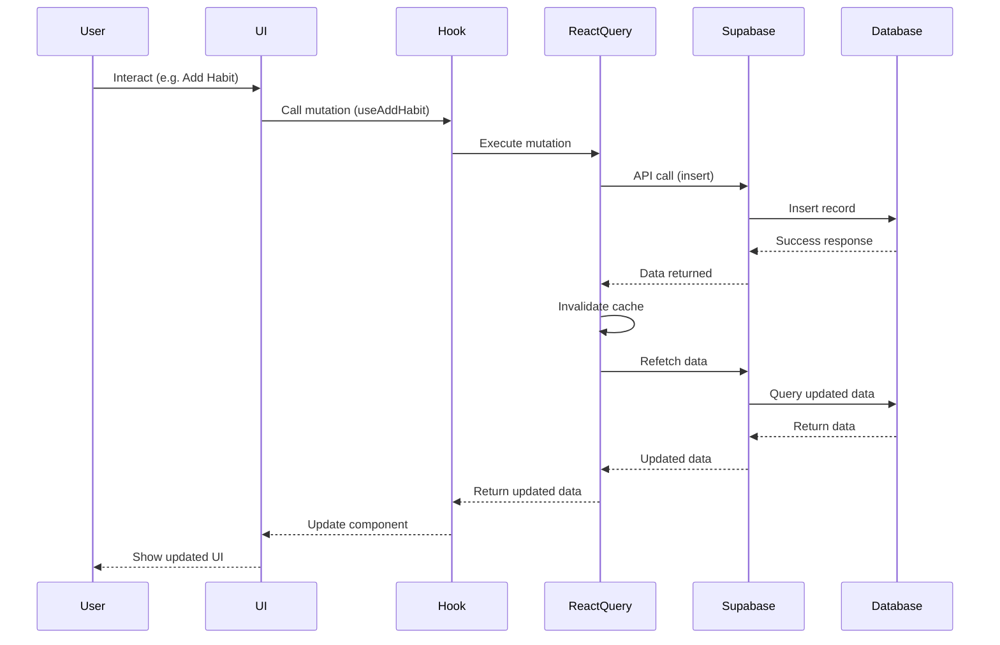
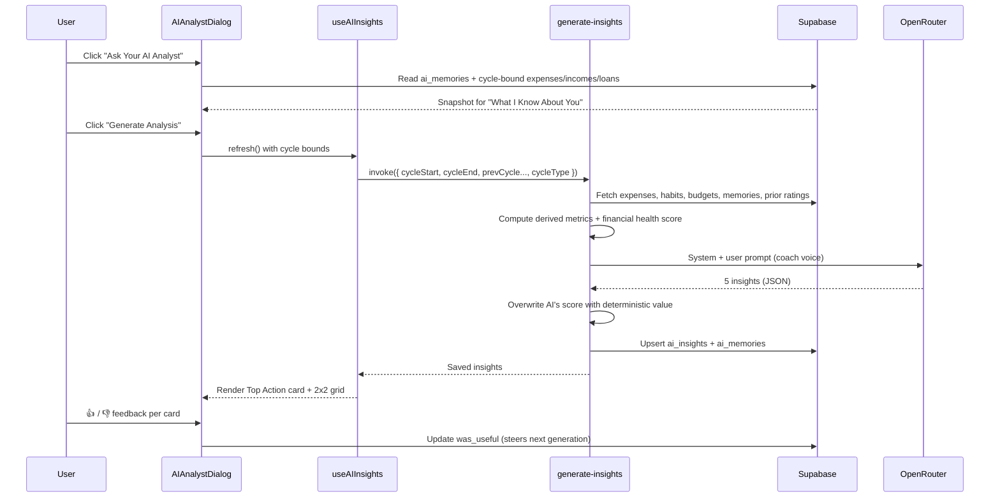
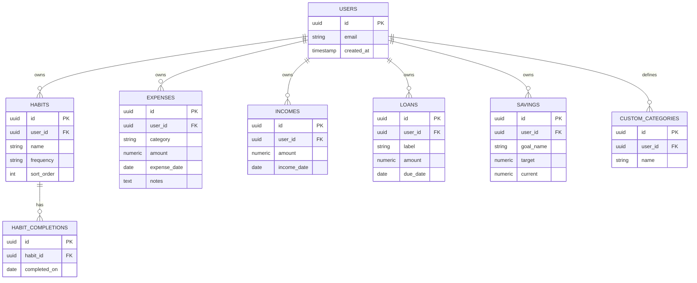
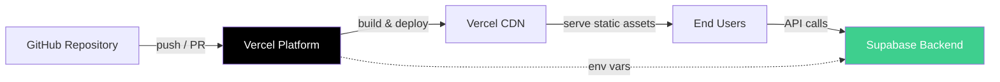

# NoSkip

NoSkip is a personal productivity web application that combines two essential self‑improvement tools — a daily **expense tracker** and a **habit tracker** — into one clean, unified dashboard. The core philosophy is simple: *what gets tracked, gets improved*.

By logging spending and habits side by side, NoSkip helps you see how your financial discipline and daily behaviors influence each other over time.

> 🔗 **Live site:** https://no-skip-main.vercel.app/

---

## Features

- **Unified dashboard**
  - View daily expenses and habit streaks in a single, focused layout.
  - Reduce app‑hopping and keep your self‑improvement data in one place.
- **Daily expense tracking**
  - Add expenses with category, amount, and notes.
  - See recent spending at a glance to stay accountable.
- **Habit tracking**
  - Create custom habits and mark them as completed per day.
  - Visualize streaks and consistency over weeks.
- **Clarity‑first design**
  - Minimal, distraction‑free UI.
  - Dark, modern look with subtle highlights for key information.
- **AI Finance Analyst**
  - On-demand modal that analyzes your spending and habits using a hosted LLM.
  - Coach-voice insights — spending summary, habit coaching, anomaly flag, financial health verdict, and a single "Top Action" for the week.
  - Deterministic financial health score (savings rate, budget adherence, habit consistency, expense volatility) — the AI writes the verdict, the math stays in code.
  - Cycle-aware: respects payday cycles as well as calendar months, so the analysis matches the window you actually budget against.
  - Persistent memory layer (`ai_memories`) lets the AI reference your strongest/weakest habit, biggest spending category, and expense volatility across sessions.
  - Thumbs up / down feedback on every card; the next generation avoids styles you marked unhelpful.
- **Authentication**
  - Email/password sign up & sign in.
  - Toggled auth screen with support for "primary focus" (Spending discipline, Habit consistency, Both).

---

## Tech Stack

- **Frontend**
  - React + TypeScript
  - Vite / React Router
  - Tailwind CSS
  - shadcn/ui component library
  - lucide‑react icons
- **State & Data**
  - TanStack Query (React Query)
  - Custom `AuthContext` for authentication
  - Supabase (PostgreSQL + Auth + Storage + Row Level Security)
- **Backend Logic**
  - Supabase Edge Functions (Deno) — serverless compute for the AI analyst
  - OpenRouter — LLM provider used by the `generate-insights` Edge Function
- **Tooling**
  - ESLint / Prettier
  - Vitest + Testing Library
  - npm / pnpm / yarn
  - Supabase CLI (for Edge Function deploys + migrations)

---

## Getting Started

### Prerequisites

- Node.js (LTS recommended, e.g. 18+)
- npm / yarn / pnpm

### Installation

```bash
# Clone the repository
git clone https://github.com/MirazZim/noSkip.git
cd noSkip

# Install dependencies
npm install
# or
yarn
# or
pnpm install
```

### Environment Variables

Create a `.env.local` file in the project root:

```env
VITE_SUPABASE_URL=your_supabase_url
VITE_SUPABASE_ANON_KEY=your_supabase_anon_key
```

The AI Finance Analyst runs inside the `generate-insights` Supabase Edge Function. Its secrets live on the Supabase side, not in the Vite bundle:

```bash
supabase secrets set OPENROUTER_API_KEY=your_openrouter_key
supabase functions deploy generate-insights
```

### Run Locally

```bash
npm run dev
```

---

## Architecture

### System Architecture



---

### Component Architecture





---

### Data Flow



---

### AI Insights Flow



---

### Database Schema



---

## Security

- Row Level Security (RLS) enabled on all Supabase tables — users can only access their own data.
- JWT tokens managed and auto-refreshed by the Supabase client.
- Admin role with elevated permissions and a separate audit log table.

---

## Deployment

Deployed automatically via Vercel on every push to `main`.



---

## Roadmap

- [ ] Progressive Web App (PWA) — offline support & installability
- [ ] Real-time multi-device sync
- [ ] Push notifications for habit reminders
- [x] AI-powered insights and predictions
- [ ] PDF report export
- [ ] Calendar and fitness app integrations

---

## License

MIT
